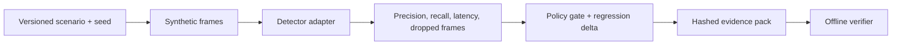

# Engineering case study

## Purpose and boundary

ARES Lite is an offline reliability and benchmarking toolkit for synthetic video-detection pipelines. It evaluates evidence, not operational suitability. It has no live targeting, autonomous action, hardware-control, or real-person-tracking capability.

## Reproducible experiment

The run metadata records the scenario and dataset snapshot, detector backend, thresholds, random seed, stress parameters, environment diagnostics, and repository commit. Repeating a fixed manifest is covered by deterministic tests; numerical tolerances and detector limitations are surfaced in reports.

## Five-minute demonstration

1. Run `make docker-selftest` to generate the single golden synthetic scenario and exercise the full stack.
2. Run `make demo`, open the UI, and select **Run Demo**.
3. Inspect precision, recall, delay, dropped-frame behavior, robustness factors, and the acceptance gate.
4. Download the evidence ZIP.
5. Run `python scripts/verify_evidence.py path/to/evidence_pack.zip`; alter a declared file and observe verification fail.

## Limitations

Synthetic fixtures are intentionally small. Motion and optional YOLO adapters do not establish real-world performance. Results must not be interpreted as safety certification or operational advice.
